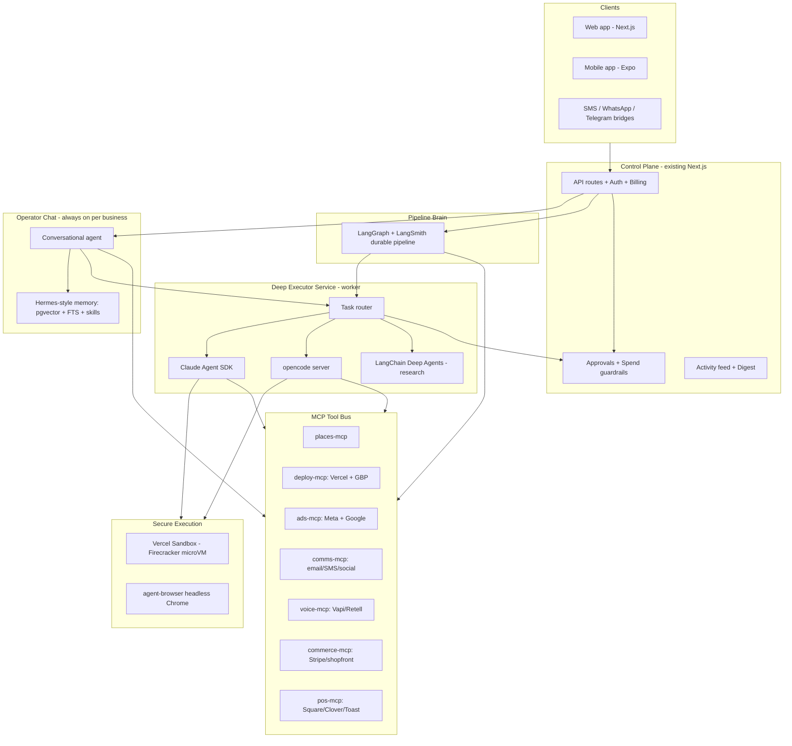
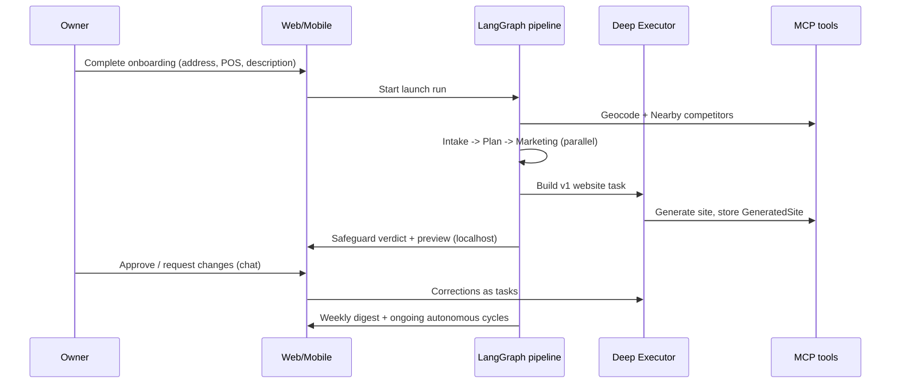
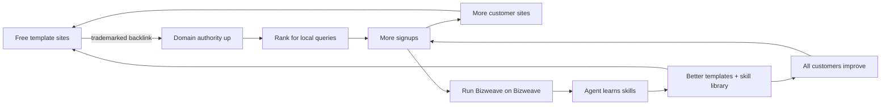

# Bizweave — Autonomous AI Operator for Local Businesses

## 1. Positioning & Thesis

- **Who**: Physical, owner-operated small businesses (liquor/retail, restaurants/cafes, salons/barbers, gyms, trades, clinics, auto shops). People with no time and no desire to become technical.
- **Promise**: "Hire one AI operator that runs your entire online presence — from $400/mo instead of a $3,000/mo agency or hire." Start free with a real website; grow into a fully managed operator.
- **Wedge vs Polsia**: Polsia targets founders building new startups and runs fully autonomously with no guardrails, no validation, weak data portability, and a 20% take-rate. We target *existing* local businesses, keep a human-approval + spend-guardrail layer (the `[Safeguard](src/lib/agents/prompts.ts)` agent + `[ApprovalPolicy](prisma/schema.prisma)`), integrate **POS/local systems**, and offer **transparent tiered pricing (no take-rate) + full data export** as trust differentiators.
- **Growth model**: a free SEO-seed tier (trademarked, backlinked template sites) plus a dogfooding loop where Bizweave runs on Bizweave — the product markets and improves itself (Section 9).
- **Market gap (Section 13)**: static builders (Durable, ~$12-85/mo) don't operate the business; autonomous "AI company" platforms (Polsia, NanoCorp, Cofounder) target *new startups*; local front-desks (Podium, ~$500-800/mo) only do leads/reviews/messaging. No one runs a *full autonomous operator* (build + intel + outreach + phone + ads) for *existing physical* businesses at $400-600 — that is our wedge.
- **Reuse decision**: Keep ~80% of the current stack (Next.js 16, Prisma 7, Supabase auth, BYOK LLM, scheduler/queue, approvals, activity feed, DB-served sites, design system). Refocus onboarding, data model, agents, and add the deep-execution + comms + ads + voice + mobile layers.

## 2. Core Architecture — Layered Harness Strategy

The key idea: use each proven harness for what it is best at, glued by **MCP** as a shared tool bus. Nothing gets rebuilt from scratch.




- **Layer 0 — MCP Tool Bus (shared)**: one MCP server per capability domain so every harness calls the same audited tools. This is where all "real world" actions live (deploy a site, add a domain, query competitors, send email, start an ad, provision a phone number). Actions tagged high-risk route through `[ApprovalPolicy](prisma/schema.prisma)`/`[PendingAction](prisma/schema.prisma)` before executing.
- **Layer 1 — Pipeline Brain (LangGraph + LangSmith)**: durable, checkpointed, observable multi-agent pipeline for scheduled/automated work — replaces the bespoke loop in `[src/lib/agents/orchestrator.ts](src/lib/agents/orchestrator.ts)` and `[src/lib/scheduler.ts](src/lib/scheduler.ts)` per the repo's own [migration doc](docs/AGENT_FRAMEWORK_MIGRATION.md). Human-in-the-loop via `interrupt()`. Parallel fan-out for independent agents.
- **Layer 2 — Deep Executor (hands)**: a worker service exposing `runTask(spec)` that routes open-ended jobs to the right harness — **Claude Agent SDK** (`@anthropic-ai/claude-agent-sdk` `query()`/`startup()`, tools, hooks, `max-budget-usd`) for Anthropic-key users, **opencode** (`opencode serve` + `@opencode-ai/sdk`) for OpenAI/other BYOK users, and **LangChain Deep Agents** (already a dep in `[pyproject.toml](pyproject.toml)`) for research sub-agents with delegation + virtual FS. All heavy/untrusted work runs inside **Vercel Sandbox** microVMs (with `agent-browser` for web tasks); **NemoClaw/OpenShell** is the optional hardened substrate for enterprise.
- **Layer 3 — Operator Chat (the thing you message)**: an always-on per-business agent with **Hermes-Agent-style persistent memory** (agent-curated memory, skills that improve, cross-session recall). It interprets "create an AI receptionist" / "run an ad", answers directly, adjusts pipeline config, or dispatches Layer-2 deep tasks. Reachable from web, mobile push, and messaging bridges.

**Harness roles, restated**: Claude Agent SDK + opencode = hands; LangGraph = orchestration brain; Deep Agents = research sub-agents; Hermes = memory + always-on operator + messaging; NemoClaw/OpenShell + Vercel Sandbox = secure substrate; MCP = the tool protocol they all share. BYOK is preserved end-to-end via the existing `[getPreferredProvider](src/lib/llm/keys.ts)`.

## 3. New Dependencies & External Services

- **Harnesses**: `@anthropic-ai/claude-agent-sdk`, `@opencode-ai/sdk` (+ opencode binary), `@langchain/langgraph` `@langchain/core` `@langchain/langgraph-sdk`, `deepagents` (already present), Hermes-Agent (self-hosted worker or its memory pattern reimplemented on pgvector).
- **Execution**: `@vercel/sandbox` (Firecracker microVMs, snapshots for sub-second boot, `agent-browser`).
- **Hosting/domains**: Vercel REST API (`POST /v13/deployments`, `POST /v10/projects/{id}/domains` + verify), Google Business Profile API.
- **Local data**: Google Places API (New) Nearby Search (`places:searchNearby`) + Geocoding; Yelp Fusion as secondary.
- **Comms**: Resend (email + inbound webhooks), Twilio (SMS/WhatsApp), X/Meta/LinkedIn APIs (extend `[src/lib/integrations/](src/lib/integrations/index.ts)`).
- **Voice**: Vapi (primary, API-first BYOK) with Retell as alternative; Twilio numbers.
- **Ads**: Meta Marketing API, Google Ads API; image generation for creative.
- **Commerce/POS**: Stripe (billing + shopfront/checkout), and POS connectors (Square, Clover, Toast, Lightspeed, Shopify POS) for inventory/orders.
- **Billing**: Stripe Billing for the Free/$400/$600/$1,500 bands, with metered pass-through for ad spend, voice minutes, and LLM usage.
- **Mobile**: Expo / React Native + Expo push.
- **Data/AI infra**: pgvector (memory + competitor/embedding retrieval), LangSmith (traces).

## 4. Data Model Additions (`prisma/schema.prisma`)

Extend `[Business](prisma/schema.prisma)` and add new models (all multi-tenant, owner-scoped):

- **Business (extend)**: `addressLine1/2`, `city`, `region`, `postalCode`, `country`, `lat`, `lng`, `hours` (JSON), `serviceArea`, `posSystem`, `orderMgmtSystem`, `websiteUrl`, `googleBusinessProfileId`, `socialHandles` (JSON), `categories` (JSON).
- **Competitor**: `businessId`, `name`, `address`, `lat/lng`, `distanceMeters`, `rating`, `reviewCount`, `priceLevel`, `website`, `phone`, `categories`, `source` (places/yelp), `raw` (JSON), `embedding` (vector), `lastRefreshedAt`.
- **Deployment**: `businessId`, `target` (local/vercel/gbp), `url`, `domain`, `subdomain`, `provider`, `providerRef`, `status`, `logs`, `isTemplate` (free-tier), `backlinkEnabled` (trademarked dofollow attribution), `templateId`.
- **AgentTask** (open-ended deep-executor jobs): `businessId`, `origin` (chat/pipeline/schedule), `harness` (claude-sdk/opencode/deepagents), `spec` (JSON), `status`, `sandboxId`, `costUsd`, `budgetUsd`, `artifacts` (JSON), `approvalId?`.
- **Conversation / Message**: chat threads per business (web/mobile/bridge), roles, tool-call traces, attachments.
- **MemoryEntry**: `businessId`, `kind` (fact/preference/skill/summary), `content`, `embedding`, `salience`, `ttl`, `source` — the Hermes-style store.
- **Contact / MembershipProgram / Membership / Campaign / CampaignSend**: CRM + outreach + loyalty.
- **AdCampaign / AdCreative / AdSpendEvent**: ads with budget caps and spend ledger.
- **PhoneAgent / CallLog**: AI receptionist config + call records/transcripts.
- **Subscription / Invoice / UsageEvent**: billing + metering; `tier` (free/presence/growth/full) + `entitlements` (JSON quotas/caps) drive feature gating everywhere.
- **SkillLibrary / SkillPromotion**: global reusable skills + templates promoted from per-business `MemoryEntry` (powers the dogfood self-improvement loop in Section 9).
- **IntegrationConnection**: OAuth tokens (encrypted via `[src/lib/crypto.ts](src/lib/crypto.ts)`) for POS, Google, Meta, etc., with health + refresh.

## 5. Capability Workstreams (your 6 requirements + chat + additions)

### 5.1 Onboarding v2 (rewrite `[src/app/onboarding/page.tsx](src/app/onboarding/page.tsx)`)

- Steps: Contact & location (name, full address → geocode, phone, email, hours, socials) → Business profile (detailed description, categories, service area) → Systems (POS, order mgmt, inventory source, existing website/domain, Google Business Profile) → Goals & guardrails (budget caps, what needs approval) → Launch.
- On launch, kick the pipeline (existing `[POST /api/businesses/[id]/run](src/app/api/businesses/[id]/run/route.ts)`) which now geocodes, seeds competitors, and builds v1 site.

### 5.2 Task 1 — Website generation + hosting

- **Fast path**: keep the template `[Builder](src/lib/agents/fallback.ts)` agent → persists `[GeneratedSite](prisma/schema.prisma)`, served immediately at `[src/app/sites/[slug]/page.tsx](src/app/sites/[slug]/page.tsx)` (localhost first, as requested). Add a publish-status gate (currently missing) so drafts aren't public.
- **Deep path**: Deep Executor builds a richer multi-page site in a sandbox (real files, images, SEO schema, accessibility), previewable, then promoted.
- **Production hosting (later)**: `deploy-mcp` deploys to Vercel via REST API and returns a live URL; DB-served remains the zero-config default.

### 5.3 Task 2 — Technical feature setup ("figure it out")

- Deep Executor tasks for: shopfront/checkout (Stripe or Medusa), booking/reservations, dashboards, "install software" = configure/authorize integrations and provision infra, POS inventory sync.
- Each task = an `AgentTask` in a sandbox with MCP tools, budget cap, and artifact capture; risky steps hit approval gates.

### 5.4 Task 3 — User corrections

- Handled conversationally by the Operator Chat → spawns `AgentTask`s: attach an owned domain (Vercel domains API + DNS instructions), point Google Business Profile to the new site, restyle, edit copy, swap images. All reversible where possible (rewind/rollback playbooks).

### 5.5 Task 4 — Competitor analysis

- Geocode business address → `places:searchNearby` by category/radius → `Place Details` → dedupe → store `Competitor` rows + embeddings for later retrieval. Optional `agent-browser` scrape of competitor sites for pricing/positioning. Scheduled daily refresh via the pipeline; findings feed marketing/ads/outreach via shared memory.

### 5.6 Task 5 — Outreach

- Memberships/loyalty programs, email distro (Resend + list mgmt + templates + CAN-SPAM unsubscribe), social campaigns (X/Meta/LinkedIn), SMS/WhatsApp (Twilio, TCPA opt-in). Built on the existing [integration registry](src/lib/integrations/index.ts) with dry-run mode + approval for external sends.

### 5.7 Chat operator + "create an AI receptionist" / "run an ad"

- **Operator Chat** (web + mobile + bridges) with persistent memory: interprets intent, dispatches deep tasks, streams progress from the harness.
- **AI receptionist**: `voice-mcp` provisions a Vapi assistant + Twilio number, injects business knowledge (hours, menu, FAQs, booking), function-calls into CRM/booking; `CallLog` + transcripts surface in the dashboard.
- **Ads**: agent researches local market (competitors + audience) → generates creative (copy + images) → builds Meta/Google campaigns via `ads-mcp` → **mandatory approval + daily budget cap** before spend → `AdSpendEvent` ledger + ROAS reporting.

### 5.8 Additions I'm adding (you asked me to)

- Reviews/reputation mgmt (respond to Google/Yelp), local SEO (schema.org, GBP posts, citations), reservations/booking + calendar, analytics feedback loop (GA4/Plausible → agents), weekly "while you slept" digest, gift cards, data-portability export (full ZIP), demand/spend validation gate before paid acquisition, compliance layer (CAN-SPAM, TCPA, WCAG), and per-business global pause + spend freeze windows.

## 6. Onboarding → First Launch Flow




## 7. Phased Roadmap (built in iterations)

- **Phase 0 — Foundation & refocus**: rebrand copy to local-business positioning; extend `Business` schema + migrations; add `.env.example`; re-enable auth middleware (`[src/middleware.ts](src/middleware.ts)`); publish-status gate on public sites.
- **Phase 1 — Onboarding v2 + geocoding + competitor seed**.
- **Phase 2 — MCP tool bus v1** (`places-mcp`, `deploy-mcp`, `comms-mcp`) + approval routing for tool actions.
- **Phase 3 — Deep Executor + Vercel Sandbox** (Claude Agent SDK + opencode routing, `AgentTask` model, budget caps, artifact capture) → real website build + technical setup tasks.
- **Phase 4 — Operator Chat + persistent memory** (web first) with task dispatch + streaming.
- **Phase 5 — Pipeline migration to LangGraph + LangSmith** (durable, parallel, HITL) replacing the bespoke orchestrator/scheduler.
- **Phase 6 — Outreach & CRM** (memberships, email, social, SMS) with dry-run + approvals.
- **Phase 7 — AI receptionist** (Vapi + Twilio).
- **Phase 8 — Ads engine** (Meta/Google + creative gen + budget guardrails + validation gate).
- **Phase 9 — Hosting/domains/GBP** production deploys.
- **Phase 10 — Billing (Free/$400/$600/$1,500 Stripe bands) + tier entitlements/quotas + metering + data-portability export**.
- **Phase 11 — Mobile app (Expo)** + push + messaging bridges.
- **Phase 12 — Hardening, compliance, observability, launch**.
- **Phase 13 — Growth flywheel & self-hosting**: free-tier template engine + subdomain hosting + trademarked backlink component (tier toggle); seed the internal Bizweave business (dogfood); skill-promotion pipeline into the global library. (Can start once template hosting + billing exist.)

## 8. Pricing & Feature Bands

Each band unlocks a new tier of capability. Ad spend, voice minutes beyond plan caps, and (metered) LLM usage pass through transparently — **no revenue take-rate** (the trust wedge vs Polsia's 20%). Gating is enforced by `Subscription.tier` + a central `entitlements` map checked in API routes, the pipeline, and the Deep Executor (quota + budget caps per tier).

- **Free — "Listing" (our SEO seed)**: one pick-a-template website auto-filled from a short form (name, address, hours, description), hosted on a Bizweave subdomain (`{slug}.bizweave.site`). Carries a **trademarked "Website by Bizweave" dofollow backlink** to our marketing site. No autonomous agents; Operator Chat limited to a few messages/mo. Purpose: acquisition + the SEO flywheel (Section 9), with an upsell CTA in the owner dashboard.
- **$400/mo — "Presence"**: custom AI-built multi-page website (Deep Executor) + hosting + connect-your-own-domain; branding/backlink removed. Operator Chat with a monthly deep-task quota. Initial competitor snapshot + monthly refresh. Baseline local SEO (schema.org, GBP optimization) + review monitoring. Weekly "while you slept" digest.
- **$600/mo — "Growth"**: everything in Presence, plus autonomous scheduled cycles ("runs while you sleep"); outreach (email + social + SMS) + CRM + memberships/loyalty; review responses + deeper local SEO; ad **plans + creative** (recommendations, capped managed spend); higher task quota.
- **$1,500/mo — "Full Operator"**: everything in Growth, plus the AI receptionist (Vapi minutes up to a cap), fully managed Meta/Google ad campaigns with budget management, POS/inventory sync + shopfront/checkout, multi-location, priority build queue, and concierge onboarding.
- **Multi-business / multi-location discount**: $250/mo off each *additional* business, floored at $1,000/mo per business. Because the floor exceeds the Presence/Growth list prices, in practice it's a multi-location discount on Full Operator — e.g., 1st business $1,500, 2nd $1,250, 3rd and beyond $1,000 each. Rationale: owners with multiple businesses/locations can afford it, and $1,000 stays margin-safe (~65% gross margin at ~$348 Full-tier COGS). Additional Presence/Growth businesses simply pay their normal list price (already below the floor).

## 9. Growth Flywheel — Dogfooding & SEO Loop

Two compounding loops make the product market and improve itself.

- **SEO backlink flywheel**: every Free (and optionally paid) site ships a trademarked "Website by Bizweave" dofollow backlink. Thousands of indexed local-business sites linking back lifts our domain authority → our marketing pages rank for high-intent local queries → more signups → more sites → more backlinks (the loop that grew Wix/Squarespace/Linktree). Consent is explicit: Free tier keeps the backlink as the deal; paid tiers can toggle it off.
- **Dogfood / self-improvement loop**: Bizweave runs *on* Bizweave. Our own marketing site + presence is an internal `Business` operated by the same agents (SEO, content, A/B tests, ads, competitor intel). Wins the agent discovers are captured as **skills in the shared Hermes-style memory** and promoted into the global `SkillLibrary`/template library → every customer (and the Free templates) improves → better templates → stronger SEO seed → the loop tightens. "The website improves our website."




Build implications: a **template site engine** (fast, form-filled, subdomain-hosted), a **backlink/attribution component** with trademark + tier-aware toggling, an internal "Bizweave" business seeded at deploy, and a **skill-promotion pipeline** from per-business memory into the global library.

## 10. Governance, Safety & Reliability (differentiators)

- Approval gates for external comms, ad spend increases, pricing/offer changes, domain/DNS changes; two-step confirm for irreversible actions.
- Real-world completion verification (don't mark "done" until the tool confirms delivery/deploy); auto-refund credits on verified failures.
- Per-business pause + spend freeze windows; immutable audit log; rollback playbooks per integration; sandbox isolation for all untrusted execution; LangSmith traces + failure events surfaced in the activity feed.

## 11. Performance & Parallelism

- Pre-warm harness processes (`startup()`/`opencode serve`) and Vercel Sandbox **snapshots** for sub-second boots; parallel LangGraph fan-out for independent agents; parallel sandboxes for independent deep tasks; sub-agent delegation via Deep Agents / the Task pattern; streaming everywhere for perceived speed.

## 12. Key Risks & Mitigations

- **Autonomy blast radius** → approval gates + spend caps + dry-run + sandbox + rollback.
- **Cost runaway** (LLM + ads + voice) → budget caps per task/business, metering, alerts.
- **Third-party API/policy risk** (Meta/Google/Places rate limits, ad policy) → circuit breakers, backoff, compliance checks, graceful fallbacks.
- **Harness sprawl** → the uniform `runTask` router + MCP tool bus keep harnesses swappable behind one interface.
- **Data portability/trust** → first-class export from day one.

## 13. Competitive Landscape & Teardown

Two competitor clusters. Cluster A ("AI runs your company") targets *new founders* — Polsia's category. Cluster B (local-business SaaS) targets *existing owners* — our actual buyers. Our wedge is the gap between them.

### Cluster A — Autonomous "AI company" platforms (the Polsia model)

- **Polsia** — 9 agents on staggered schedules via Claude Code headless; $49/mo + 20% take-rate. Reviews: unreliable task completion, no validation/approval, lock-in, slow support. Reuse: cadence scheduler, live activity feed, infra bundling. Avoid: no guardrails, take-rate, poor portability.
- **NanoCorp** (YC) — full autonomy framed as online RL climbing one reward signal (revenue); public performance feed at `/live`; $30/mo (30 credits, up to 2,000), 20% withdrawal fee; free = 3 lifetime credits + subdomain. Reuse: the reward-signal idea (powers our self-learning loop, Section 14) and a public `/live` feed as credibility marketing.
- **Cofounder.co** — "agentic departments" (eng/sales/marketing/design/finance/ops) with managers + shared context, **human approval on risky actions**, extensible via **MCP + custom APIs + Stripe**, parallel background tasks. Closest architectural analog to our plan. Reuse: department framing, approval gates, MCP extensibility, background parallelism.
- **Lindy** — personal work assistant ($49.99-199.99); notable for (a) **"Lindy Validator"** — a second-LLM layer that double-checks side-effectful actions before they run, and (b) routing to cheap models (DeepSeek V4) for large cost savings. Reuse both: Validator mirrors our Safeguard; cheap-model routing protects margin (Section 16).
- **HeyBoss** — website + light ops, $25/mo + build; static after build.

### Cluster B — Local-business incumbents (our real competition)

- **Durable** ("business builder") — website in ~30s from a form + CRM + invoicing + AI marketing (Google/social ads) + **Google Business Profile integration**; Free = branded subdomain; $12-22 Launch, $85 Grow. Strengths: speed, bundling, non-technical UX — exactly our Free/Presence target. Weaknesses (reviews): template lock-in, **no code export**, shallow SEO, generic copy, no real e-commerce, **no agentic/autonomous ops**. Our edge: an autonomous *operator*, not a static builder, and we export.
- **Podium** ("AI-powered front desk") — $399 Core / $599 Pro / $999+ Ent, +$99 AI receptionist, +$50/location, +10DLC fees → real spend $500-800/mo. **AI Employee** suite: AI Salesperson (<60s lead response 24/7), AI Scheduler, AI Marketer (drip), AI Concierge, AI Reputation Specialist; runs a **review → ranking → leads → review compounding loop** (validates our flywheel). Reviews: 4.6 G2 but heavy complaints on billing opacity, hard cancellation, aggressive sales, and **robotic AI replies**. Our edge: broader scope (we also build the site, run competitor intel, execute ads, do deep technical tasks), transparent pricing, less-generic output via self-learning.
- **Reputation/messaging**: Birdeye ($299+), NiceJob ($75-125, 4.9 Capterra), Chekkit ($100-200), DemandHub ($200-400).
- **AI receptionists** (price ceiling for our Full-tier voice; candidates to white-label vs. build on Vapi): Rosie ($49/250min → $299/2,000min, trains off your site/GBP), Goodcall ($79-249, per-unique-caller, unlimited minutes, SOC2/HIPAA), Dialzara ($29-349 per-minute), Slang.ai (restaurants), Smith.ai (human backup), echowin (omnichannel), Marblism (approval-gated AI employees).

### What we rip out & reuse (logic-wise)

- **Cadence scheduler + public live feed** (Polsia/NanoCorp) — scheduler exists; add a `/live` feed for credibility.
- **Agentic departments + approval gates + MCP extensibility** (Cofounder) — our Layer-1 pipeline + MCP tool bus + `ApprovalPolicy`.
- **Validator / second-LLM check** (Lindy) — our Safeguard agent gates side-effectful actions.
- **Cheap-model routing + caching** (Lindy) — margin protection (Section 16).
- **Form → site → GBP → CRM → AI ads bundle** (Durable) — our Free/Presence experience.
- **AI Employee suite + review→SEO compounding loop + <60s response** (Podium) — our Growth/Full capabilities; validates the flywheel (Section 9).
- **Reward-signal learning** (NanoCorp) — per-business KPI reward for the self-learning loop (Section 14).

### What's broken across the field (our differentiators)

- Billing opacity, lock-in, painful cancellation (Podium, Polsia) → transparent flat pricing + one-click data export + no take-rate.
- Robotic/generic AI output (Podium, Durable) → self-learning per-business voice (Section 14).
- No validation → wasted ad spend (Polsia) → demand/spend validation gate + budget caps.
- Unreliable "done" signals (Polsia) → real-world completion verification.
- Startup-only focus (Polsia/NanoCorp/Cofounder) → purpose-built for existing local, physical businesses (POS, address, hours, reviews, foot traffic).

## 14. Self-Learning Loop (Hermes-style — smarter every turn)

The operator improves with each interaction, per business and across the fleet — mirroring Hermes Agent's closed learning loop (agent-curated memory + autonomous skill creation + skills that self-improve + cross-session recall + user modeling).

- **Memory (per business, private)**: `MemoryEntry` (facts, brand voice, preferences, constraints, past decisions) with vector + FTS retrieval, injected into every agent/chat prompt (recency + relevance + salience weighting). Periodic "nudge" jobs prompt the agent to consolidate and persist important learnings.
- **Skills (reusable procedures)**: after a successful complex task, the Deep Executor distills a `Skill` (parameterized playbook: steps, tools, prompts) with success stats; skills self-improve on reuse and are edited when they fail. Compatible with the agentskills.io open standard so we can import community/Claude/Codex skills too.
- **Reward signal (why it gets smarter)**: every action gets an `Evaluation` scored against real business KPIs — bookings, calls answered, review count/rating delta, ad ROAS, site conversion, email/SMS reply rate (NanoCorp's "climb a reward" scoped to per-business outcomes). Low-scoring skills/prompts are deprecated; high-scoring ones are reinforced and weighted up in retrieval. LangSmith evals feed scoring.
- **Consolidation → global library (fleet learning + dogfood)**: a scheduled job promotes high-performing, **PII-scrubbed, opt-in** skills from per-business memory into the global `SkillLibrary`/template library (with review). Every business — and the Free templates — then benefits; this is the mechanism behind Section 9's dogfood loop. Raw business data never crosses tenants (Section 15).
- **Guardrails**: learned skills that touch side-effectful tools still pass Safeguard + approval before executing — a bad lesson cannot auto-escalate risk.

## 15. Multi-Tenancy, Isolation & Multi-Business

### Isolation model (defense in depth)

- **Data**: Postgres Row-Level Security (Supabase) on every table keyed by `userId`/`businessId` (repo already ships `[rls-baseline.sql](docs/supabase/rls-baseline.sql)`); all queries tenant-scoped, no cross-tenant joins.
- **Secrets**: per-`IntegrationConnection` tokens encrypted with AES-256-GCM (`[src/lib/crypto.ts](src/lib/crypto.ts)`); per-business envelope keys (KMS) so one leak can't unlock the fleet; BYOK keys scoped to the user.
- **Compute**: every deep task runs in its own ephemeral **Vercel Sandbox** Firecracker microVM, created per task and destroyed after — no shared filesystem or process between businesses; **NemoClaw/OpenShell** deny-by-default network for hardened tenants.
- **Process/queue**: per-business queues, concurrency quotas, and rate limits (tier-based) to stop noisy neighbors; per-business + per-task **budget caps** (LLM $, sandbox $, ad $, voice minutes) enforced by the router before execution.
- **Artifacts/packages**: each business's site/app is a separate deployable (isolated Vercel project or DB record), its own subdomain/custom domain, and separate comms/ads/voice sub-accounts (own sending domain/number) so reputation and rate limits never bleed across tenants.
- **Memory**: `MemoryEntry` strictly per business; only PII-scrubbed, opt-in skills reach the global library (Section 14).

### Multiple businesses per user

- **Model**: add a `Workspace`/Org layer — `User → Workspace → Business[]` (schema already has `User.businesses[]`; add Workspace for teams + shared billing). A **business switcher** in web/mobile + a **portfolio dashboard** (health, spend, runs, approvals across all businesses — the Polsia multi-company view done better, with per-business budget guardrails + anomaly alerts).
- **Billing**: **each business is its own subscription/tier** (costs scale per business), with a **multi-business discount of $250/mo per additional business, floored at $1,000/mo each** (so Full Operator steps $1,500 → $1,250 → $1,000 → $1,000…), and one consolidated invoice per workspace. BYOK keys can be shared at the user level while budgets/quotas stay per business.
- **Roles**: owner/admin/staff RBAC per workspace; staff scopable to specific businesses (essential for franchise / multi-location owners — a core local use case).

## 16. Financial Feasibility & Unit Economics

Reference prices (2026, verified this session — re-validate before launch): Vercel Sandbox $0.128/vCPU-hr active CPU (I/O wait free) + $0.0212/GB-hr memory + $0.60/1M creations (build-and-test 30 min ≈ $0.34; quick task ≈ $0.01-0.03). LLM: cheap ~$0.05-0.30/M input (GPT-5-nano, Gemini Flash-Lite/Flash), mid ~$1.25-3/M (GPT-5, Claude Sonnet), frontier ~$5-15/M (Opus, GPT-5 Pro); batch −50%, caching up to −90%. Places ~$32/1k searches ($200/mo free credit). Voice (Vapi) ~$0.13-0.37/min all-in. Twilio number ~$1.15/mo. Email (Resend) ~$20/50k.

### Cost strategy (protects margin)

- **Model routing**: default to cheap models for routine work; escalate to Sonnet/GPT-5 only for deep build/creative; frontier only when required. Prompt caching + batch for recurring cycles (Lindy's playbook).
- **Active-CPU sandboxing**: agent workloads are I/O-bound (LLM/API waits are free on Vercel Sandbox) → build tasks cost cents.
- **Pass-through**: ad spend, voice minutes beyond caps, and metered LLM overages bill to the customer — COGS variance capped.
- **BYOK option**: technical customers supplying keys push LLM COGS toward $0 (managed is the default for non-technical owners, so we model managed below).

### Per-business monthly COGS + gross margin (managed, mid estimates)

- **Free ("Listing")** — revenue $0; COGS target < $2 (one-time template gen ~$0.20, subdomain hosting ~$0, tiny overhead; no live agents/Places/comms). Loss-leader funded by SEO backlinks + funnel; strictly capped + verification to prevent abuse.
- **$400 "Presence"** — COGS ≈ $50-55 (LLM ~$15, sandbox ~$4, Places ~$3, hosting ~$2, email ~$1, Stripe fee ~$12, overhead ~$5, thin support ~$10). **Gross profit ≈ $348, margin ≈ 87%.**
- **$600 "Growth"** — COGS ≈ $110-115 (LLM ~$45, sandbox ~$10, Places ~$4, comms ~$8, hosting ~$3, Stripe ~$18, overhead ~$6, support ~$20). **Gross profit ≈ $486, margin ≈ 81%.**
- **$1,500 "Full Operator"** — COGS ≈ $345-350 (LLM ~$110, sandbox ~$25, receptionist voice ~400 bundled min ~$90, comms ~$15, Places ~$5, commerce/POS ~$5, hosting ~$5, Stripe ~$45, overhead ~$8, support ~$40). **Gross profit ≈ $1,152, margin ≈ 77%** (ad spend/voice/LLM overages pass-through, so downside is capped).

### Blended economics (assumed mix 50% Presence / 35% Growth / 15% Full)

- **ARPU ≈ $635/mo**; blended COGS ≈ $118; **blended gross profit ≈ $517/mo (~81% margin)**.
- **CAC**: target $300-900 blended (SEO flywheel + Free funnel lower it over time). **Payback ≈ 1-2 months.**
- **LTV**: at ~~4%/mo churn (~~25-mo life) → LTV ≈ $517 × 25 ≈ **~$12,900**; **LTV:CAC ≈ 14-40x** (temper for early churn; still very healthy).
- **Break-even**: at ~~$50k/mo fixed (lean team + base infra), break-even ≈ **~~100 paying businesses**.
- **Free-tier math**: ~~$2/free-user/mo; at 3-8% free→paid, 100 free users (~~$200/mo cost) yield 3-8 conversions worth $1,550-4,140/mo gross profit + backlink SEO value → strongly accretive; guard with caps, verification, throttling.
- **Multi-location economics**: the $250/additional-business discount floors at $1,000/mo, which at ~~$348 Full-tier COGS still yields ~$652 gross profit (~~65% margin). Portfolio/franchise accounts feel like a volume deal yet remain strongly profitable, and they raise workspace LTV while amortizing one CAC across many businesses.

### Why the pricing is aggressive yet safe

- Undercuts Podium ($500-800 for a narrower front-desk) and agencies ($2,500-7,500) while doing **more** (build + intel + outreach + phone + ads), because AI replaces the labor that is an agency's dominant cost. Even the entry $400 tier holds ~87% gross margin, so we can discount, bundle, or absorb ad-management on competitive deals without going underwater.

## 17. Making It Properly Smart — Intelligence & Autonomy

"Smart" is the compounding of memory + RAG + skills + reward learning + dreaming + plan-from-scratch + extensible tools. This section answers the specific hard problems.

### 17.1 Novel tasks with no prior pattern

- **Retrieval-first**: match the request against the `SkillLibrary` + memory. High confidence → run the skill. **No match / low confidence → Planner path**: a from-scratch decomposition by a strong model (Claude Agent SDK / Deep Agents) in a sandbox, using MCP tools + web research + browser.
- **Confidence-based routing**: novel/high-stakes → escalate to a frontier model + larger planning budget; routine/known → cheap model.
- **Verify → learn**: on success, distill a new `Skill` (Section 14) so the novel task is a known pattern next time. On ambiguity/high risk, ask the owner in chat or route to approval before acting.
- **Safety**: novel side-effectful actions always dry-run + Safeguard + approval first.

### 17.2 Agentic purchases & credential/API-key provisioning

- **Money (2026 rails)**: use **Stripe Issuing for agents** — one-time-use virtual cards or **Shared Payment Tokens** scoped by amount/merchant/time; the agent never touches raw card credentials. Optionally adopt **AP2 mandates** (owner signs an **Intent Mandate** upfront for delegated autonomous spend; **Cart Mandate** per purchase) for cryptographic, auditable authorization.
- **Procurement policy engine**: vendor allow-list, per-purchase + monthly caps per business, mandatory approval above threshold, two-step confirm for irreversible buys; every purchase logs a receipt + ledger entry, with spend-freeze windows + anomaly alerts.
- **Account & API-key setup**: prefer official APIs/OAuth (registrars, ad platforms, email). Where no API exists, the Deep Executor uses **browser automation** (`agent-browser` in the sandbox) to sign up, complete forms, and retrieve API keys, storing them encrypted in `IntegrationConnection` (per-business envelope keys, Section 15). Approval required for any account creation that incurs cost or accepts legal terms.

### 17.3 Local RAG knowledge base (per business)

- A per-business **RAG index** (pgvector, tenant-isolated) over everything the operator knows: brand kit, docs, product/menu catalog, POS/inventory, FAQs, past decisions, competitor intel, reviews, prior conversations. Injected into every generator (site, ads, social, email), the receptionist, and the chat operator.
- Optional **self-hosted embedding model** to cut embedding COGS at fleet scale; hybrid vector + FTS with recency/salience weighting (shared with Section 14 memory). "Local" also means data stays in our tenant-isolated store — a portability/trust plus.

### 17.4 Brand memory — the small things (mottos, logos, colors, voice)

- A versioned **BrandKit / BrandAsset registry** per business: logo variants, color palette, typography, tagline/motto, tone-of-voice, imagery, do/don'ts — the single source of truth injected into every artifact so site, ads, receptionist greeting, and emails stay consistent and on-brand. Version history + rollback; the agent may propose refinements (via dreaming) but changes pass approval.

### 17.5 Dreaming state + night batch tasks

- A nightly **"dream"/reflection cron** per business: review the day's KPIs + memory, generate improvement hypotheses (campaigns, pricing, content, features, fixes), score them against the reward signal (Section 14), and queue the best as **proposals** in the morning brief for approval — Polsia's morning-plan/evening-summary/"mood" done with guardrails.
- **Batch/off-peak execution**: non-urgent work (competitor refresh, content, embeddings, digests, dreaming) runs through provider **Batch APIs (−50%)** aggregated across the fleet at night → major COGS savings (Section 16). Interactive work stays real-time.
- A lightweight per-business **"mood/health" signal** (revenue trend, pending approvals, issues) surfaced in the dashboard.

### 17.6 Feature requests & per-business roadmap

- When an owner asks for something new (chat), capture a **FeatureRequest/Initiative** → triage (feasibility/cost/tier) → plan → execute via Deep Executor → track to done with visible progress. The operator can also propose initiatives from dreaming. A per-business **roadmap/backlog view** keeps requested + agent-proposed work in one place (feeds the dashboard Tasks panel).

## 18. Extensibility — Skills, MCP Servers, Plugins & Connectors

- **Skills**: the `SkillLibrary` (Section 14) is the primary extension point; supports the **agentskills.io** open standard so we can import community/Claude/Codex skills and export our own. Versioned, permissioned, reward-scored.
- **MCP registry**: new capabilities are added by registering **MCP servers** into the tool bus (Section 2), with per-workspace/per-business enable toggles. The Claude Agent SDK and opencode harnesses consume MCP natively, so abilities grow without redeploys.
- **Plugins / connectors marketplace**: OAuth-based connectors to systems local businesses actually use — POS (Square, Clover, Toast, Lightspeed, Shopify POS), accounting (QuickBooks, Xero), calendars/booking (Google Calendar, Calendly, Vagaro), CRMs, reviews (Google/Yelp), delivery (DoorDash/Uber Eats), messaging (WhatsApp/Instagram/SMS). Each = an `IntegrationConnection` with health checks, token refresh, and dry-run mode.
- **Governance**: every new tool/skill/connector inherits approval + budget + Safeguard; nothing bypasses guardrails.

## 19. Platform Operations — Instant Deploy, Maintenance & Scale

### 19.1 Instant live sites (reachable the moment they're created)

- **Wildcard subdomain** `*.bizweave.site` at the edge → the instant a site is generated it is live at `{slug}.bizweave.site` (edge/DB-served via the existing `[sites/[slug]](src/app/sites/[slug]/page.tsx)` route), no build step. Then optionally **promote** to a Vercel deployment + custom domain in the background (Section 5.2 / Phase 10).
- Wildcard TLS (Cloudflare/Vercel) so every subdomain is HTTPS immediately; the publish-status gate controls visibility.

### 19.2 Maintenance & self-healing

- A scheduled **maintenance agent** monitors each business's assets: uptime, broken links, performance, SSL + **domain expiry**, integration **token expiry/refresh**, stale content, and dependency updates on generated sites. Issues auto-open tasks; low-risk fixes auto-apply via the Deep Executor, higher-risk ones hit approval. All surfaced in the activity feed + digest.

### 19.3 Scaling

- Stateless control plane (Next.js) behind autoscaling; queue-based workers; **per-task ephemeral Firecracker sandboxes** scale to thousands concurrently (active-CPU billing keeps it cheap); pre-warmed harness pools + sandbox snapshots for latency.
- DB tenant-scoped with read replicas + hot-table partitioning by tenant; response + prompt caching; model routing + batching for LLM cost/scale; multi-region later. Everything metered per business (Section 16) with budget caps preventing runaway cost.

## 20. Operator Dashboard UI (Once UI Pro)

Keep Polsia's all-in-one, single-glance philosophy but make it richer and on-brand using **Once UI Pro** (`@once-ui-system/core` + Pro blocks: dashboard, sidebar, widgets, bento, header; Tailwind starter available) layered over our existing Tailwind v4 dark-premium tokens.

- **Left**: business identity card with a **health/"mood" indicator**, plan/tier + credits, revenue snapshot, Setup Payments, and a **workspace/business switcher** (portfolio, Section 15).
- **Center**: **Tasks & approvals** (tagged feature/research/outreach/maintenance), **Documents** (mission, market research, brand kit), and a **Website** panel (live `{slug}.bizweave.site` link + Manage Domain).
- **Channels**: **Site, Social, Email, Ads, Phone (receptionist)** each a live widget with status + quick actions (Run Ads, Post, etc.).
- **Activity**: real-time **"while you slept"** stream (successes and failures) + the morning brief from the dreaming cron.
- **Right**: the **Operator Chat** ("Ask your operator anything") with streaming, the agent's daily report, and inline one-click approvals.
- Mobile mirrors this chat-first (Section 5.7 / Phase 12) reusing components; optional public `**/live` feed** (NanoCorp-style) for marketing credibility.

## 21. Cybersecurity & Data Protection

Threat model: we store BYOK LLM keys, OAuth tokens, payment tokens, and PII, and run autonomous agents that browse untrusted content and can spend money + take actions. Two headline risks: (a) multi-tenant data/secret leakage, (b) prompt injection / confused-deputy driving the agent to harmful or costly actions.

**Infrastructure & data**

- Encryption everywhere: TLS in transit; AES-256-GCM at rest (already in `[crypto.ts](src/lib/crypto.ts)`); **per-tenant envelope keys via a KMS**, not one global key. Secrets in a vault (Supabase Vault/KMS), never in DB plaintext or client bundles, and redacted from logs/traces.
- Multi-tenant isolation: Postgres RLS on every table (Section 15), tenant-scoped queries, per-business encryption context; automated tests that assert cross-tenant reads fail.
- AuthN/AuthZ: enforce the re-enabled middleware, add **MFA/TOTP** for owners, short-lived sessions, workspace RBAC (owner/admin/staff), least-privilege OAuth scopes per connector.
- Network/app: Vercel Firewall/WAF + per-tenant rate limits (extend `[rate-limit.ts](src/lib/rate-limit.ts)`), SSRF protection on all fetch/browse, dependency + secret scanning in CI, signed webhooks.

**Agent-specific security (critical for an autonomous operator)**

- Treat ALL external content (websites, reviews, inbound email/SMS, competitor pages) as untrusted. **Quarantine-and-summarize**: untrusted content is processed by a constrained model that cannot call tools; only structured, validated output crosses into the planning/execution context.
- **Tool-call allow-lists + policy engine**: the executor may only call approved tools with validated args; irreversible/costly actions require approval, spend is capped (Section 23), and secrets are never placed in prompts the model could exfiltrate.
- **Egress control** on sandboxes: outbound network allow-list per task (only domains the task needs) to stop exfiltration/SSRF; ephemeral Firecracker microVMs destroyed after each task (Section 15).
- Injection/jailbreak monitoring via the Safeguard agent + LangSmith traces; anomaly alerts on unusual tool/spend patterns; per-business + global **kill-switch**.

**Governance & resilience**

- Immutable, exportable **audit log** of every action/decision/approval (also a liability shield, Section 22).
- Backups + point-in-time recovery + tested restore (DR); data retention + right-to-delete (GDPR/CCPA) via hard-delete jobs.
- **SOC 2 Type II** roadmap, annual pen test + bug bounty, and a documented incident-response runbook (detect -> contain -> notify within legal windows -> remediate).

## 22. Liability, Legal & Trust (protecting us and the customer)

Because the agent acts on the owner's behalf, liability is managed through consent, guardrails, evidence, insurance, and clear terms.

**Authorization & agency (the core shield)**

- Explicit **authorization/consent** at onboarding: the owner delegates *scoped* authority (which channels, what it may spend, what needs approval), tied to **AP2 Intent Mandates** (Section 17.2) so autonomous spend is cryptographically bound to owner-signed constraints.
- **Approval gates** on every irreversible/public/costly action (publish, send, post, buy, call) — a safety and liability boundary: a human authorized it, with a timestamped audit trail as evidence.
- Per-action **provenance** (who/what/why/model/version) retained as the record of authorization.

**Legal terms**

- **ToS + Acceptable Use Policy**: prohibited uses, customer responsibilities (accuracy of business info, lawful use, honoring opt-outs), our right to suspend.
- **Limitation of liability + disclaimers**: service "as-is," damages capped to fees paid, consequential damages disclaimed; explicit "not legal/financial/medical/tax advice" and "AI can err — review before relying" notices.
- **Indemnification** (mutual, scoped): customer indemnifies for content they provide/approve; we indemnify for our IP/infringement.
- **DPA + subprocessor list** (OpenAI/Anthropic/Twilio/Stripe/etc.), privacy policy, and consent management; we act as processor for their business data.
- **Insurance**: Tech E&O + Cyber liability + General liability, scaled with ARR.

**Compliance by channel (enforced in code, not just policy)**

- Email: CAN-SPAM (physical address, one-click unsubscribe, honor within 10 days) — enforced in comms-mcp (Phase 7/13).
- SMS/voice: TCPA + 10DLC registration, prior express consent, quiet hours, STOP/HELP handling.
- Reviews/ads: platform-ToS compliance (no fake reviews; ad-policy checks pre-submit via Safeguard).
- Accessibility: WCAG on generated sites (Phase 13). Privacy: GDPR/CCPA data-subject requests, consent tracking, minimization.

**Content & brand safety**

- The Safeguard agent reviews all outbound/public artifacts for legal/brand/policy issues before they go live; blocked items route to a human.

## 23. Usage Limits, Cost Caps & Pay-As-You-Go

Two distinct cost buckets, handled differently:

- **Platform COGS** (our LLM + sandbox compute): included in the subscription up to tier quotas; overage billed as PAYG credits.
- **Pass-through spend** (ad budget, Twilio SMS/voice, domain purchases, connector fees): the customer's money, funded via their card/credits and capped by the procurement policy (Section 17.2) — no markup (no take-rate, Section 8).

**Tier entitlements & usage limits**

- Each `Subscription` carries an `entitlements` JSON: monthly agent-task minutes, LLM credit allowance, deep-exec sandbox hours, emails/SMS, receptionist minutes, managed ad-spend ceiling, # sites/domains, connectors. Enforced centrally on every metered action against `UsageEvent` (Phase 11).
- **Soft caps** alert the owner at 80/100% (dashboard + email); **hard caps** pause the metered capability until top-up/approval — a **circuit breaker** so nothing runs away.

**Cost caps (budgets)**

- Per-business **monthly budget cap** for platform compute + a separate **pass-through spend cap**; per-task budget ceilings already enforced in the executor (Sections 15, 17.2). Plus a global fleet cost guardrail for us.
- Anomaly detection halts spend on abnormal patterns; owners can set custom lower caps.

**Pay-as-you-go (after included usage)**

- A **credits wallet** (Stripe metered billing) — the "Add Credits" model seen in the Polsia dashboard. When included usage is exhausted, the owner either enables **auto-recharge** (buy $X credits when balance < threshold, with a monthly ceiling) or the capability pauses.
- Credits meter platform usage transparently (per-action line items in `UsageEvent`); pass-through purchases draw from credits or the linked card via one-time virtual cards (Section 17.2).
- **Upgrade nudge**: a business that consistently exceeds its tier is prompted to move up a band (cheaper than PAYG at volume).

## 24. Decisions I Made (defaults, no questions asked)

- Reuse and refocus Bizweave rather than greenfield.
- Primary deep harness = Claude Agent SDK, with opencode for non-Anthropic BYOK and Deep Agents for research; Hermes pattern for memory/messaging.
- Sandbox = Vercel Sandbox now, NemoClaw/OpenShell optional later.
- Voice = Vapi primary; Hosting = DB-served (localhost) now, Vercel later; Local data = Google Places primary.
- Pricing = Free (SEO-seed, trademarked + backlinked template sites) plus $400/$600/$1,500 bands, no take-rate; growth compounds via the backlink + dogfood flywheel (Section 9). Validated at 77-87% gross margin with ~100-business break-even (Section 16).
- Billing = per business (workspace-consolidated invoice); multi-business discount of $250/mo per additional business, floored at $1,000/mo each; managed LLM default with a BYOK option.
- Self-learning = per-business private memory + KPI reward scoring + PII-scrubbed, opt-in promotion into a global skill library (Section 14).
- Isolation = Postgres RLS + per-task ephemeral Firecracker microVMs + per-business budgets/quotas + separate comms/ads/voice sub-accounts (Section 15).
- Competitive wedge = full autonomous operator for existing physical businesses, priced below Podium/agencies while doing more (Section 13).
- Novel tasks = retrieval-first, then plan-from-scratch fallback with confidence-based model routing, distilled back into skills (Section 17.1).
- Agentic purchases = Stripe Issuing for agents (one-time virtual cards / Shared Payment Tokens) + optional AP2 signed mandates, behind a procurement policy (vendor allow-list, caps, approval, receipts); accounts/API keys provisioned via OAuth or sandboxed browser automation into the encrypted vault (Section 17.2).
- Knowledge = per-tenant local RAG + a versioned BrandKit as the single sources of truth injected into every generator, the receptionist, and chat (Sections 17.3-17.4).
- Proactivity + cost = nightly dreaming/reflection cron producing approval-gated proposals, plus fleet Batch-API off-peak execution for -50% COGS (Section 17.5).
- Extensibility = skills (agentskills.io) + an MCP-server registry + an OAuth connector marketplace (POS/accounting/calendar/CRM/reviews/delivery), all inheriting guardrails (Section 18).
- Ops = instant-live wildcard subdomains on create, a maintenance/self-healing agent, and horizontally scaled sandbox workers (Section 19); dashboard built with Once UI Pro (Section 20).
- Security = per-tenant envelope keys via KMS, RLS + cross-tenant tests, MFA + RBAC, WAF/rate-limit/SSRF, sandbox egress allow-lists, and a prompt-injection quarantine + tool-allow-list pattern; SOC 2 roadmap + pen test + IR runbook + backups/DR (Section 21).
- Liability = scoped owner authorization (AP2 Intent Mandates) + approval gates + immutable audit as the shield, backed by ToS/AUP/DPA, limitation-of-liability + disclaimers + indemnity, insurance (Tech E&O/Cyber), and in-code channel compliance (CAN-SPAM/TCPA/10DLC/GDPR/CCPA/WCAG) (Section 22).
- Usage/cost = tier entitlements + metering with soft/hard caps (circuit breakers) and per-business budgets, then PAYG credits (Stripe metered) with auto-recharge; platform COGS metered, pass-through spend capped with no markup, and upgrade nudges above tier (Section 23).

---

# Build-Ready Appendices (implementation-grade detail)

These appendices exist so a low-cost coding model can execute mechanically: exact schema, env, contracts, file skeletons, and per-phase "done when" checks. They match the current repo conventions verified in `[src/lib/db.ts](src/lib/db.ts)`, `[src/lib/auth.ts](src/lib/auth.ts)`, `[src/lib/llm/client.ts](src/lib/llm/client.ts)`, `[src/lib/agents/contracts.ts](src/lib/agents/contracts.ts)`, and `[src/app/api/businesses/route.ts](src/app/api/businesses/route.ts)`. Status fields stay `String` with documented values (matching the existing schema style), IDs are `cuid()`, and every model carries `createdAt`/`updatedAt` where the repo does.

## Appendix A - Prisma Schema Delta

Apply to `[prisma/schema.prisma](prisma/schema.prisma)`. After editing: `npm run db:generate && npm run db:push` (dev). Enable pgvector + RLS via a raw SQL migration (Appendix D.6).

Datasource/generator (add pgvector; keep existing output path):

```prisma
datasource db {
  provider   = "postgresql"
  extensions = [vector] // pgvector for embeddings
}

generator client {
  provider        = "prisma-client"
  output          = "../src/generated/prisma"
  previewFeatures = ["postgresqlExtensions"] // drop if GA in your Prisma 7
}
```

Extend `Business` (add fields + relations; keep existing ones):

```prisma
model Business {
  // ...existing fields...
  addressLine1            String?
  addressLine2            String?
  city                    String?
  region                  String?
  postalCode              String?
  country                 String?  @default("US")
  lat                     Float?
  lng                     Float?
  hours                   Json?
  serviceArea             String?
  posSystem               String?
  orderMgmtSystem         String?
  websiteUrl              String?
  googleBusinessProfileId String?
  socialHandles           Json?
  categories              Json?
  workspaceId             String?
  workspace               Workspace? @relation(fields: [workspaceId], references: [id], onDelete: SetNull)

  brandKit            BrandKit?
  competitors         Competitor[]
  deployments         Deployment[]
  agentTasks          AgentTask[]
  conversations       Conversation[]
  memories            MemoryEntry[]
  contacts            Contact[]
  membershipPrograms  MembershipProgram[]
  campaigns           Campaign[]
  adCampaigns         AdCampaign[]
  phoneAgents         PhoneAgent[]
  callLogs            CallLog[]
  subscription        Subscription?
  usageEvents         UsageEvent[]
  creditWallet        CreditWallet?
  integrations        IntegrationConnection[]
  skills              Skill[]
  featureRequests     FeatureRequest[]
  purchases           Purchase[]
  procurementPolicies ProcurementPolicy[]
  auditLogs           AuditLog[]

  @@index([workspaceId])
}
```

New models (tenancy, brand, knowledge, ops, chat, CRM, ads, voice, billing, procurement, integrations, learning, governance):

```prisma
model Workspace {
  id          String   @id @default(cuid())
  name        String
  ownerUserId String
  createdAt   DateTime @default(now())
  updatedAt   DateTime @updatedAt
  businesses  Business[]
  members     WorkspaceMember[]
}

model WorkspaceMember {
  id            String    @id @default(cuid())
  workspaceId   String
  workspace     Workspace @relation(fields: [workspaceId], references: [id], onDelete: Cascade)
  userId        String // -> User.id (add `workspaceMemberships WorkspaceMember[]` to User if you want the back-relation)
  role          String    @default("owner") // owner | admin | staff
  businessScope Json? // null = all businesses; else string[] of businessIds
  createdAt     DateTime  @default(now())

  @@unique([workspaceId, userId])
}

model BrandKit {
  id         String   @id @default(cuid())
  businessId String   @unique
  business   Business @relation(fields: [businessId], references: [id], onDelete: Cascade)
  motto      String?
  voice      String?
  palette    Json? // {primary, secondary, accent, bg, text}
  typography Json? // {display, body, mono}
  logoUrl    String?
  version    Int      @default(1)
  createdAt  DateTime @default(now())
  updatedAt  DateTime @updatedAt
  assets     BrandAsset[]
}

model BrandAsset {
  id         String   @id @default(cuid())
  brandKitId String
  brandKit   BrandKit @relation(fields: [brandKitId], references: [id], onDelete: Cascade)
  kind       String // logo | image | font | color | doc
  url        String?
  value      String?
  version    Int      @default(1)
  createdAt  DateTime @default(now())

  @@index([brandKitId, kind])
}

model MemoryEntry {
  id         String                       @id @default(cuid())
  businessId String
  business   Business                     @relation(fields: [businessId], references: [id], onDelete: Cascade)
  kind       String // fact | preference | decision | doc | competitor | review | conversation | skill_note
  content    String
  salience   Float                        @default(0.5)
  source     String?
  ttl        DateTime?
  embedding  Unsupported("vector(1536)")?
  createdAt  DateTime                     @default(now())

  @@index([businessId, kind, createdAt])
}

model Deployment {
  id              String   @id @default(cuid())
  businessId      String
  business        Business @relation(fields: [businessId], references: [id], onDelete: Cascade)
  target          String // subdomain | vercel | custom
  url             String?
  subdomain       String?  @unique // {slug}.bizweave.site
  domain          String?
  provider        String? // vercel
  providerId      String?
  status          String   @default("live") // building | live | failed | offline
  isTemplate      Boolean  @default(false)
  backlinkEnabled Boolean  @default(true)
  templateId      String?
  createdAt       DateTime @default(now())
  updatedAt       DateTime @updatedAt

  @@index([businessId, status])
}

model AgentTask {
  id             String    @id @default(cuid())
  businessId     String
  business       Business  @relation(fields: [businessId], references: [id], onDelete: Cascade)
  conversationId String?
  title          String
  harness        String // claude-agent-sdk | opencode | deep-agents | inline
  spec           Json // see Appendix C AgentTaskSpec
  status         String    @default("queued") // queued | planning | running | needs_approval | done | failed | cancelled
  sandboxId      String?
  costUsd        Float     @default(0)
  budgetUsd      Float     @default(5)
  artifacts      Json?
  approvalId     String?
  error          String?
  createdAt      DateTime  @default(now())
  updatedAt      DateTime  @updatedAt
  startedAt      DateTime?
  completedAt    DateTime?

  @@index([businessId, status, createdAt])
}

model Conversation {
  id         String    @id @default(cuid())
  businessId String
  business   Business  @relation(fields: [businessId], references: [id], onDelete: Cascade)
  channel    String    @default("web") // web | mobile | sms | whatsapp | telegram
  title      String?
  createdAt  DateTime  @default(now())
  updatedAt  DateTime  @updatedAt
  messages   Message[]

  @@index([businessId, updatedAt])
}

model Message {
  id             String       @id @default(cuid())
  conversationId String
  conversation   Conversation @relation(fields: [conversationId], references: [id], onDelete: Cascade)
  role           String // user | assistant | system | tool
  content        String
  toolName       String?
  taskId         String?
  createdAt      DateTime     @default(now())

  @@index([conversationId, createdAt])
}

model Competitor {
  id          String                       @id @default(cuid())
  businessId  String
  business    Business                     @relation(fields: [businessId], references: [id], onDelete: Cascade)
  name        String
  placeId     String?
  address     String?
  lat         Float?
  lng         Float?
  rating      Float?
  reviewCount Int?
  priceLevel  Int?
  website     String?
  phone       String?
  categories  Json?
  notes       String?
  embedding   Unsupported("vector(1536)")?
  lastSeenAt  DateTime                     @default(now())
  createdAt   DateTime                     @default(now())

  @@unique([businessId, placeId])
  @@index([businessId, rating])
}

model Contact {
  id             String         @id @default(cuid())
  businessId     String
  business       Business       @relation(fields: [businessId], references: [id], onDelete: Cascade)
  name           String?
  email          String?
  phone          String?
  tags           Json?
  consentEmail   Boolean        @default(false)
  consentSms     Boolean        @default(false)
  unsubscribedAt DateTime?
  source         String?
  createdAt      DateTime       @default(now())
  updatedAt      DateTime       @updatedAt
  memberships    Membership[]
  sends          CampaignSend[]

  @@unique([businessId, email])
  @@index([businessId, createdAt])
}

model MembershipProgram {
  id          String       @id @default(cuid())
  businessId  String
  business    Business     @relation(fields: [businessId], references: [id], onDelete: Cascade)
  name        String
  perks       Json?
  status      String       @default("active")
  createdAt   DateTime     @default(now())
  memberships Membership[]
}

model Membership {
  id        String            @id @default(cuid())
  programId String
  program   MembershipProgram @relation(fields: [programId], references: [id], onDelete: Cascade)
  contactId String
  contact   Contact           @relation(fields: [contactId], references: [id], onDelete: Cascade)
  tier      String?
  points    Int               @default(0)
  joinedAt  DateTime          @default(now())

  @@unique([programId, contactId])
}

model Campaign {
  id          String         @id @default(cuid())
  businessId  String
  business    Business       @relation(fields: [businessId], references: [id], onDelete: Cascade)
  channel     String // email | sms | whatsapp | social
  name        String
  subject     String?
  body        String
  status      String         @default("draft") // draft | scheduled | sending | sent | failed
  scheduledAt DateTime?
  createdAt   DateTime       @default(now())
  updatedAt   DateTime       @updatedAt
  sends       CampaignSend[]

  @@index([businessId, status])
}

model CampaignSend {
  id         String    @id @default(cuid())
  campaignId String
  campaign   Campaign  @relation(fields: [campaignId], references: [id], onDelete: Cascade)
  contactId  String
  contact    Contact   @relation(fields: [contactId], references: [id], onDelete: Cascade)
  status     String    @default("queued") // queued | sent | delivered | opened | clicked | bounced | failed
  providerId String?
  sentAt     DateTime?

  @@unique([campaignId, contactId])
  @@index([campaignId, status])
}

model AdCampaign {
  id             String         @id @default(cuid())
  businessId     String
  business       Business       @relation(fields: [businessId], references: [id], onDelete: Cascade)
  platform       String // meta | google
  name           String
  objective      String?
  status         String         @default("draft") // draft | pending_approval | active | paused | ended
  dailyBudgetUsd Float?
  totalSpentUsd  Float          @default(0)
  externalId     String?
  startDate      DateTime?
  endDate        DateTime?
  createdAt      DateTime       @default(now())
  updatedAt      DateTime       @updatedAt
  creatives      AdCreative[]
  spend          AdSpendEvent[]

  @@index([businessId, status])
}

model AdCreative {
  id           String     @id @default(cuid())
  adCampaignId String
  adCampaign   AdCampaign @relation(fields: [adCampaignId], references: [id], onDelete: Cascade)
  headline     String?
  body         String?
  imageUrl     String?
  cta          String?
  externalId   String?
  createdAt    DateTime   @default(now())
}

model AdSpendEvent {
  id           String     @id @default(cuid())
  adCampaignId String
  adCampaign   AdCampaign @relation(fields: [adCampaignId], references: [id], onDelete: Cascade)
  amountUsd    Float
  impressions  Int?
  clicks       Int?
  conversions  Int?
  occurredAt   DateTime   @default(now())

  @@index([adCampaignId, occurredAt])
}

model PhoneAgent {
  id          String    @id @default(cuid())
  businessId  String
  business    Business  @relation(fields: [businessId], references: [id], onDelete: Cascade)
  provider    String    @default("vapi")
  providerId  String?
  phoneNumber String?
  greeting    String?
  knowledge   Json?
  status      String    @default("draft") // draft | live | paused
  createdAt   DateTime  @default(now())
  updatedAt   DateTime  @updatedAt
  callLogs    CallLog[]
}

model CallLog {
  id           String      @id @default(cuid())
  businessId   String
  business     Business    @relation(fields: [businessId], references: [id], onDelete: Cascade)
  phoneAgentId String?
  phoneAgent   PhoneAgent? @relation(fields: [phoneAgentId], references: [id], onDelete: SetNull)
  direction    String // inbound | outbound
  fromNumber   String?
  toNumber     String?
  durationSec  Int?
  transcript   String?
  recordingUrl String?
  outcome      String?
  occurredAt   DateTime    @default(now())

  @@index([businessId, occurredAt])
}

model Subscription {
  id                   String    @id @default(cuid())
  businessId           String    @unique
  business             Business  @relation(fields: [businessId], references: [id], onDelete: Cascade)
  tier                 String    @default("free") // free | starter400 | growth600 | operator1500
  status               String    @default("active") // active | past_due | canceled | paused
  entitlements         Json // see Appendix C Entitlements
  stripeCustomerId     String?
  stripeSubscriptionId String?
  currentPeriodEnd     DateTime?
  discountUsd          Float     @default(0)
  createdAt            DateTime  @default(now())
  updatedAt            DateTime  @updatedAt
  invoices             Invoice[]
}

model Invoice {
  id              String       @id @default(cuid())
  subscriptionId  String
  subscription    Subscription @relation(fields: [subscriptionId], references: [id], onDelete: Cascade)
  stripeInvoiceId String?
  amountUsd       Float
  status          String       @default("open") // open | paid | void | uncollectible
  periodStart     DateTime?
  periodEnd       DateTime?
  createdAt       DateTime     @default(now())
}

model UsageEvent {
  id          String   @id @default(cuid())
  businessId  String
  business    Business @relation(fields: [businessId], references: [id], onDelete: Cascade)
  kind        String // llm_tokens | sandbox_sec | email | sms | voice_min | ad_spend | task
  quantity    Float
  unitCostUsd Float    @default(0)
  costUsd     Float    @default(0)
  meta        Json?
  occurredAt  DateTime @default(now())

  @@index([businessId, kind, occurredAt])
}

model CreditWallet {
  id                   String         @id @default(cuid())
  businessId           String         @unique
  business             Business       @relation(fields: [businessId], references: [id], onDelete: Cascade)
  balanceUsd           Float          @default(0)
  autoRecharge         Boolean        @default(false)
  rechargeThresholdUsd Float          @default(10)
  rechargeAmountUsd    Float          @default(50)
  monthlyCeilingUsd    Float          @default(500)
  updatedAt            DateTime       @updatedAt
  ledger               CreditLedger[]
}

model CreditLedger {
  id              String       @id @default(cuid())
  walletId        String
  wallet          CreditWallet @relation(fields: [walletId], references: [id], onDelete: Cascade)
  deltaUsd        Float // + top-up, - usage
  reason          String
  balanceAfterUsd Float
  createdAt       DateTime     @default(now())

  @@index([walletId, createdAt])
}

model ProcurementPolicy {
  id                String   @id @default(cuid())
  businessId        String
  business          Business @relation(fields: [businessId], references: [id], onDelete: Cascade)
  vendor            String // allow-listed vendor slug or "*"
  perPurchaseCapUsd Float    @default(50)
  monthlyCapUsd     Float    @default(200)
  requiresApproval  Boolean  @default(true)
  enabled           Boolean  @default(true)
  createdAt         DateTime @default(now())
  updatedAt         DateTime @updatedAt

  @@unique([businessId, vendor])
}

model Purchase {
  id          String    @id @default(cuid())
  businessId  String
  business    Business  @relation(fields: [businessId], references: [id], onDelete: Cascade)
  vendor      String
  description String
  amountUsd   Float
  status      String    @default("pending") // pending | approved | completed | failed | refunded
  method      String? // stripe_issuing_spt | one_time_card | oauth
  mandateId   String? // AP2 mandate reference
  receiptUrl  String?
  approvalId  String?
  createdAt   DateTime  @default(now())
  completedAt DateTime?

  @@index([businessId, status, createdAt])
}

model IntegrationConnection {
  id                   String    @id @default(cuid())
  businessId           String
  business             Business  @relation(fields: [businessId], references: [id], onDelete: Cascade)
  provider             String // square | quickbooks | google_calendar | meta | yelp | ...
  kind                 String // pos | accounting | calendar | ads | reviews | messaging | api_key
  encryptedCredentials String // AES-256-GCM envelope (per-tenant key)
  scopes               Json?
  status               String    @default("connected") // connected | expired | error | revoked
  expiresAt            DateTime?
  lastCheckedAt        DateTime?
  createdAt            DateTime  @default(now())
  updatedAt            DateTime  @updatedAt

  @@unique([businessId, provider])
  @@index([businessId, status])
}

model Skill {
  id          String                       @id @default(cuid())
  businessId  String?
  business    Business?                    @relation(fields: [businessId], references: [id], onDelete: Cascade)
  name        String
  description String?
  definition  Json // steps/tools/params, agentskills.io-compatible
  scope       String                       @default("business") // business | global
  rewardScore Float                        @default(0)
  runCount    Int                          @default(0)
  version     Int                          @default(1)
  embedding   Unsupported("vector(1536)")?
  createdAt   DateTime                     @default(now())
  updatedAt   DateTime                     @updatedAt
  evaluations Evaluation[]

  @@index([businessId, scope])
}

model Evaluation {
  id        String   @id @default(cuid())
  skillId   String
  skill     Skill    @relation(fields: [skillId], references: [id], onDelete: Cascade)
  taskId    String?
  reward    Float
  kpiDeltas Json?
  notes     String?
  createdAt DateTime @default(now())

  @@index([skillId, createdAt])
}

model SkillLibrary {
  id           String           @id @default(cuid())
  name         String           @unique
  description  String?
  definition   Json
  category     String?
  avgReward    Float            @default(0)
  installCount Int              @default(0)
  version      Int              @default(1)
  createdAt    DateTime         @default(now())
  updatedAt    DateTime         @updatedAt
  promotions   SkillPromotion[]
}

model SkillPromotion {
  id               String       @id @default(cuid())
  skillLibraryId   String
  skillLibrary     SkillLibrary @relation(fields: [skillLibraryId], references: [id], onDelete: Cascade)
  sourceSkillId    String?
  sourceBusinessId String?
  status           String       @default("proposed") // proposed | approved | rejected
  piiScrubbed      Boolean      @default(false)
  createdAt        DateTime     @default(now())
}

model FeatureRequest {
  id         String   @id @default(cuid())
  businessId String
  business   Business @relation(fields: [businessId], references: [id], onDelete: Cascade)
  source     String   @default("owner") // owner | agent_dream
  title      String
  detail     String?
  status     String   @default("triage") // triage | planned | building | done | declined
  taskId     String?
  createdAt  DateTime @default(now())
  updatedAt  DateTime @updatedAt

  @@index([businessId, status])
}

model AuditLog {
  id         String    @id @default(cuid())
  businessId String?
  business   Business? @relation(fields: [businessId], references: [id], onDelete: SetNull)
  actorType  String // user | agent | system
  actorId    String?
  action     String
  target     String?
  riskLevel  String?
  modelInfo  Json? // {model, version}
  before     Json?
  after      Json?
  mandateId  String?
  createdAt  DateTime  @default(now())

  @@index([businessId, createdAt])
}
```

## Appendix B - Environment Variables

Create `[.env.example](.env.example)` (Phase 0) with these. Required = app won't boot without it; Optional = feature-gated (degrade to fallback/dry-run when absent).

Core (required): `DATABASE_URL`, `AUTH_SECRET`, `ENCRYPTION_KEY` (64-char hex), `NEXT_PUBLIC_SUPABASE_URL`, `NEXT_PUBLIC_SUPABASE_PUBLISHABLE_KEY`, `NEXT_PUBLIC_APP_URL`, `SCHEDULER_SECRET`.

Platform LLM default (optional, enables managed mode when user has no BYOK): `OPENAI_API_KEY`, `ANTHROPIC_API_KEY`, `EMBEDDINGS_PROVIDER` (openai|local), `EMBEDDINGS_MODEL` (default `text-embedding-3-small`, 1536 dims).

Security (optional now, required for prod): `KMS_PROVIDER`, `KMS_KEY_ID` (per-tenant envelope keys).

Deep Executor / sandbox (Phase 3): `VERCEL_TOKEN`, `VERCEL_TEAM_ID`, `VERCEL_PROJECT_ID` (also reused for hosting Phase 10), `SANDBOX_EGRESS_ALLOWLIST` (comma-sep default domains).

Observability (Phase 5): `LANGSMITH_API_KEY`, `LANGCHAIN_TRACING_V2=true`, `LANGCHAIN_PROJECT`.

Competitor intel (Phase 6): `GOOGLE_PLACES_API_KEY`, `GOOGLE_MAPS_API_KEY` (geocode), `YELP_API_KEY` (optional).

Hosting/domains (Phases 10/23): `WILDCARD_ROOT_DOMAIN` (e.g. `bizweave.site`), `CLOUDFLARE_API_TOKEN`, `CLOUDFLARE_ZONE_ID`, `GOOGLE_OAUTH_CLIENT_ID`, `GOOGLE_OAUTH_CLIENT_SECRET` (GBP + Calendar).

Outreach/CRM (Phase 7): `RESEND_API_KEY`, `TWILIO_ACCOUNT_SID`, `TWILIO_AUTH_TOKEN`, `TWILIO_MESSAGING_SERVICE_SID`, `META_APP_ID`, `META_APP_SECRET`.

Receptionist (Phase 8): `VAPI_API_KEY` (Twilio reused).

Ads (Phase 9): `META_ACCESS_TOKEN`, `META_AD_ACCOUNT_ID`, `GOOGLE_ADS_DEVELOPER_TOKEN`, `GOOGLE_ADS_CLIENT_ID`, `GOOGLE_ADS_CLIENT_SECRET`, `GOOGLE_ADS_REFRESH_TOKEN`.

Billing/procurement (Phases 11/19/27): `STRIPE_SECRET_KEY`, `STRIPE_WEBHOOK_SECRET`, `STRIPE_PRICE_STARTER`, `STRIPE_PRICE_GROWTH`, `STRIPE_PRICE_OPERATOR`, `STRIPE_ISSUING_ENABLED`.

Feature flags: `FEATURE_LANGGRAPH`, `FEATURE_DEEP_EXECUTOR`, `FEATURE_DREAMING`, `FEATURE_BACKLINK_FREE_TIER` (default on for free tier).

## Appendix C - Shared Contracts & Interfaces (TypeScript)

Put shared types in `src/lib/types/` and Zod validators next to existing ones in `[src/lib/validations.ts](src/lib/validations.ts)` / `[src/lib/agents/contracts.ts](src/lib/agents/contracts.ts)`.

```ts
// src/lib/types/entitlements.ts
export type Entitlements = {
  tier: "free" | "starter400" | "growth600" | "operator1500";
  agentTaskMinutes: number;   // platform compute
  llmCreditsUsd: number;      // included platform LLM spend
  sandboxHours: number;
  emails: number;
  sms: number;
  voiceMinutes: number;
  managedAdSpendUsd: number;  // ceiling on customer-funded ad spend we manage
  sites: number;
  domains: number;
  connectors: number;
  seats: number;
};

// src/lib/types/agent-task.ts
export type AgentTaskSpec = {
  goal: string;                 // natural-language objective
  inputs?: Record<string, unknown>;
  tools?: string[];             // MCP tool names the task may use
  constraints?: string[];
  budgetUsd?: number;           // hard cap; default from tier
  requiresApproval?: boolean;   // side-effectful -> true
  dryRun?: boolean;
};
export type AgentTaskResult = {
  ok: boolean;
  summary: string;
  artifacts?: { kind: string; url?: string; value?: string }[];
  costUsd: number;
  skillLearned?: string;        // Skill.id if distilled
};

// src/lib/mcp/types.ts
export type McpTool<I = unknown, O = unknown> = {
  name: string;                 // e.g. "places.nearbySearch"
  description: string;
  sideEffect: boolean;          // true -> must go through guardAction
  riskLevel: "low" | "medium" | "high";
  inputSchema: import("zod").ZodType<I>;
  run: (input: I, ctx: McpContext) => Promise<O>;
};
export type McpContext = { businessId: string; userId: string; dryRun: boolean };

// src/lib/guard/types.ts  (central guardrail wrapper - see Appendix D.2)
export type GuardedActionInput = {
  businessId: string;
  userId: string;
  actionType: string;           // matches ApprovalPolicy.actionType
  riskLevel: "low" | "medium" | "high";
  payload: unknown;
  estCostUsd?: number;
  vendor?: string;              // for purchases -> ProcurementPolicy
  execute: () => Promise<unknown>;
  dryRun?: boolean;
};
```

## Appendix D - Implementation Conventions & Recipes

### D.1 Route handler skeleton (Next.js 16, matches repo)

```ts
import { NextResponse } from "next/server";
import { getSession } from "@/lib/auth";
import { db } from "@/lib/db";

export async function POST(
  request: Request,
  { params }: { params: Promise<{ id: string }> }
) {
  const session = await getSession();
  if (!session) return NextResponse.json({ error: "Unauthorized" }, { status: 401 });

  const { id } = await params;
  const business = await db.business.findFirst({ where: { id, userId: session.id } });
  if (!business) return NextResponse.json({ error: "Not found" }, { status: 404 });

  try {
    const body = await request.json();
    // validate with a Zod schema from src/lib/validations.ts, then act
    return NextResponse.json({ ok: true });
  } catch (error) {
    console.error("route error:", error);
    return NextResponse.json({ error: "Failed" }, { status: 500 });
  }
}
```

### D.2 Guarded side-effect wrapper (the single most important pattern)

Every real-world action (publish, send, post, buy, call, deploy, provision) goes through `guardAction()` in `src/lib/guard/guard.ts`. Never call an external side-effecting API directly from a route/agent.

Behavior: (1) resolve `ApprovalPolicy` for `businessId`+`actionType`; (2) enforce entitlements + `CreditWallet`/budget caps + `ProcurementPolicy` (if `vendor`); (3) if approval required and not yet approved -> create `PendingAction` (status `pending`) and return `{ status: "needs_approval", pendingActionId }` without executing; (4) if `dryRun` -> simulate + return preview; (5) else run `execute()`, then write `AuditLog` + `UsageEvent` (+ `CreditLedger` debit); (6) on cap breach -> throw `CAP_EXCEEDED` (circuit breaker). Approving a `PendingAction` re-invokes `guardAction` with an approval token.

### D.3 LLM call pattern

Always resolve keys via `getPreferredProvider(userId)` (`[src/lib/llm/keys.ts](src/lib/llm/keys.ts)`); if null, use the managed platform key (Appendix B) or the agent fallback. Then call `complete(messages, { provider, apiKey, model?, maxTokens?, temperature? })` (`[src/lib/llm/client.ts](src/lib/llm/client.ts)`). Wrap in try/catch; on error or Zod-parse failure, use the agent's fallback (mirror `[src/lib/agents/fallback.ts](src/lib/agents/fallback.ts)`). Record a `UsageEvent{ kind: "llm_tokens" }`.

### D.4 Add an agent (4-file pattern)

To add/modify an agent, touch all four in lockstep: (1) type + pipeline entry in `[src/lib/agents/types.ts](src/lib/agents/types.ts)`; (2) output type there; (3) Zod contract in `[src/lib/agents/contracts.ts](src/lib/agents/contracts.ts)`; (4) prompt in `[src/lib/agents/prompts.ts](src/lib/agents/prompts.ts)` + fallback in `[src/lib/agents/fallback.ts](src/lib/agents/fallback.ts)`. Validate LLM output with the Zod schema before persisting; on failure -> fallback.

### D.5 Add an MCP tool

Create `src/lib/mcp/servers/<domain>.ts` exporting `McpTool[]` (Appendix C). Register in `src/lib/mcp/registry.ts`. `sideEffect: true` tools must be invoked through `guardAction` (D.2). Per-business enablement lives in `IntegrationConnection`/workspace toggles (Phase 22).

### D.6 Prisma migrate + pgvector + RLS

Dev: `npm run db:generate && npm run db:push`. For pgvector + RLS, add a SQL migration:

```sql
CREATE EXTENSION IF NOT EXISTS vector;
ALTER TABLE "MemoryEntry" ADD COLUMN IF NOT EXISTS embedding vector(1536);
CREATE INDEX IF NOT EXISTS memory_embedding_idx ON "MemoryEntry" USING hnsw (embedding vector_cosine_ops);
-- RLS (Phase 16): repeat per tenant table
ALTER TABLE "Business" ENABLE ROW LEVEL SECURITY;
CREATE POLICY tenant_isolation ON "Business"
  USING ("userId" = current_setting('app.user_id', true));
```

Query embeddings via `db.$queryRaw` (cosine distance `<=>`), since Prisma can't order by `Unsupported` columns.

### D.7 Entitlement + metering check

Before any metered action: load `Subscription.entitlements`, sum current-period `UsageEvent` for that `kind`, compare to the entitlement; at >=80% emit a soft-cap `ActivityEvent`, at >=100% either draw from `CreditWallet` (PAYG) or throw `CAP_EXCEEDED`. Always record a `UsageEvent` after success.

### D.8 Testing + Next.js 16 caution

Colocate tests in `__tests__/` and run with `npx vitest run <path>`. Before writing any Next.js code, read `node_modules/next/dist/docs/` (breaking changes vs training data). Keep `ActivityEvent` writes non-blocking (never throw into the run). Run `npm run lint && npm run build` before marking a phase done.

## Appendix E - Definition of Done & Test Commands (per phase)

- Phase 0: DoD = new `Business` fields migrated, `.env.example` present, middleware guards protected routes, public site route 404s on non-`live` sites. Test: `npm run db:push && npm run build`; `npm run test:e2e` (auth redirect).
- Phase 1: DoD = onboarding wizard writes all fields + geocodes lat/lng + triggers a run. Test: `npm run test:e2e` (onboarding happy path).
- Phase 2: DoD = `guardAction` + places/deploy/comms MCP tools with dry-run; side-effects create `PendingAction`. Test: `npx vitest run src/lib/guard src/lib/mcp`.
- Phase 3: DoD = `AgentTask` runs in sandbox with budget cap; website build artifact captured; over-budget aborts. Test: `npx vitest run src/lib/executor` + one live smoke task.
- Phase 4: DoD = Operator Chat persists `Conversation`/`Message`, retrieves memory, dispatches a deep task, streams progress. Test: `npx vitest run src/lib/memory` + e2e chat.
- Phase 5: DoD = pipeline runs on LangGraph behind `FEATURE_LANGGRAPH` with LangSmith traces + resumable checkpoints; parity with `runAgentPipeline`. Test: `npm run test:integration`.
- Phase 6: DoD = Places nearby+details populate `Competitor` with embeddings; daily refresh scheduled. Test: `npx vitest run src/lib/competitors`.
- Phase 7: DoD = Contact/Campaign send via Resend/Twilio through `guardAction`; unsubscribe + STOP honored. Test: `npx vitest run src/lib/outreach`.
- Phase 8: DoD = receptionist provisions Vapi assistant + Twilio number; inbound call writes `CallLog` + transcript. Test: `npx vitest run src/lib/voice` + live call smoke.
- Phase 9: DoD = ad creative generated, campaign created paused/pending_approval, daily cap enforced, `AdSpendEvent` ledger + ROAS. Test: `npx vitest run src/lib/ads`.
- Phase 10: DoD = Vercel deploy + custom domain attach/verify + optional GBP link; `Deployment.status` accurate. Test: `npx vitest run src/lib/hosting` + live deploy smoke.
- Phase 11: DoD = Stripe plans + webhook set `Subscription.tier`/`entitlements`; `UsageEvent` metering; data export. Test: `npx vitest run src/lib/billing` (Stripe test mode).
- Phase 12: DoD = Expo app authenticates, chat parity, push notifications. Test: Expo build + manual device smoke.
- Phase 13: DoD = CAN-SPAM/TCPA/WCAG checks enforced in code; LangSmith dashboards; load test passes. Test: `npm run test && npm run test:e2e`.
- Phase 14: DoD = free-tier template site engine + `{slug}.bizweave.site` + dofollow backlink component (tier-toggle); dogfood business seeded. Test: `npx vitest run src/lib/sites` + e2e free signup.
- Phase 15: DoD = `Skill`/`Evaluation` written with reward scoring; cross-session recall improves task selection; opt-in global promotion PII-scrubbed. Test: `npx vitest run src/lib/learning`.
- Phase 16: DoD = RLS on all tenant tables + passing cross-tenant leak test; per-task microVM isolation; per-business budgets. Test: `npx vitest run src/lib/security/__tests__/rls.test.ts`.
- Phase 17: DoD = Workspace/business switcher; per-business `Subscription` with $250/additional discount floored at $1,000; consolidated invoice; RBAC. Test: `npx vitest run src/lib/billing/__tests__/discount.test.ts`.
- Phase 18: DoD = `BrandKit` versioned + `MemoryEntry` RAG (hybrid) injected into generators/receptionist/chat. Test: `npx vitest run src/lib/rag`.
- Phase 19: DoD = Stripe Issuing purchase via one-time card/SPT through `ProcurementPolicy` + approval; browser account/API-key provisioning stored encrypted in `IntegrationConnection`. Test: `npx vitest run src/lib/procurement` (Stripe test mode).
- Phase 20: DoD = novel task with no skill match triggers plan-from-scratch, confidence routing escalates model, success distills a `Skill`. Test: `npx vitest run src/lib/planner`.
- Phase 21: DoD = nightly dreaming cron emits KPI-scored proposals + mood signal; Batch-API path used for off-peak jobs. Test: `npx vitest run src/lib/dreaming` + manual cron tick.
- Phase 22: DoD = skills import/export (agentskills.io), MCP registry toggles per workspace, >=2 OAuth connectors with health checks. Test: `npx vitest run src/lib/mcp src/lib/connectors`.
- Phase 23: DoD = wildcard subdomain live-on-create with TLS; maintenance agent opens/auto-fixes issues; scaling knobs (pre-warm, replicas) documented + load-tested. Test: `npx vitest run src/lib/maintenance` + wildcard smoke.
- Phase 24: DoD = Once UI Pro dashboard renders all panels + inline approvals + workspace switcher; optional `/live` feed. Test: `npm run build` + `npm run test:e2e` (dashboard).
- Phase 25: DoD = KMS envelope keys, MFA, WAF/rate-limit/SSRF, sandbox egress allow-list, prompt-injection quarantine + tool allow-list, secret redaction; pen-test checklist. Test: `npx vitest run src/lib/security` + injection red-team suite.
- Phase 26: DoD = onboarding authorization/AP2 Intent Mandate captured; ToS/AUP/DPA pages live; disclaimers rendered; immutable `AuditLog` export. Test: `npx vitest run src/lib/legal` + e2e consent.
- Phase 27: DoD = soft/hard caps act as circuit breakers; `CreditWallet` PAYG + auto-recharge via Stripe metered; upgrade nudge fires above tier. Test: `npx vitest run src/lib/usage`.

